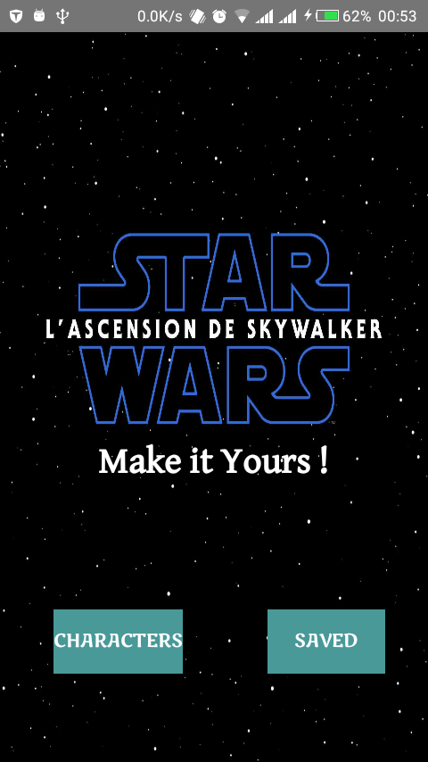
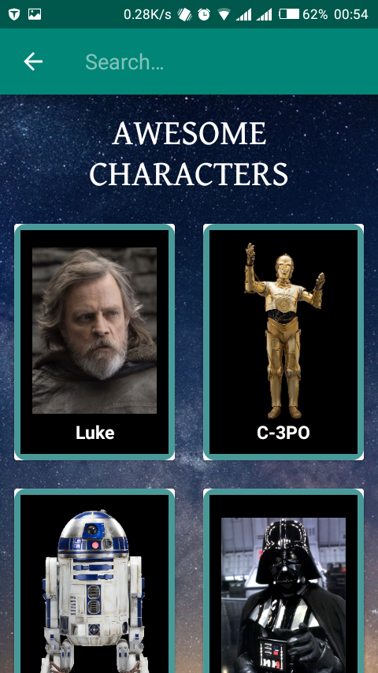
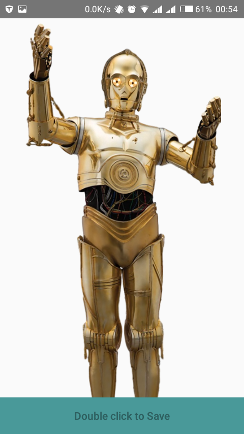
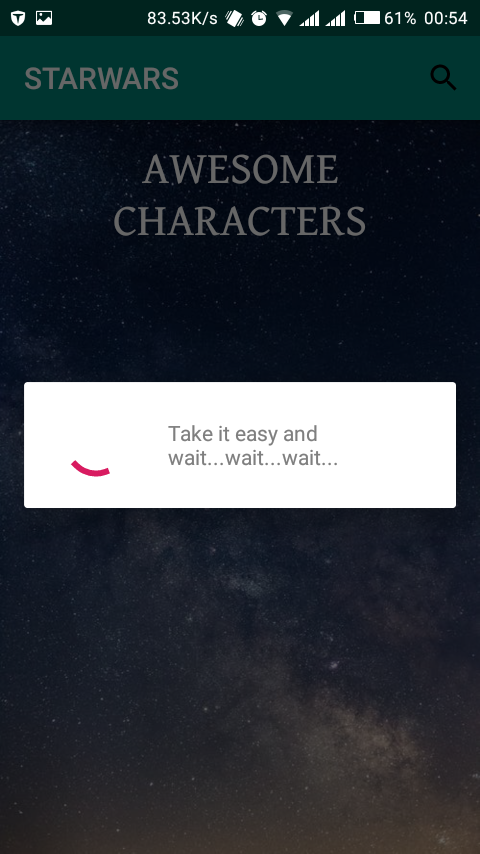
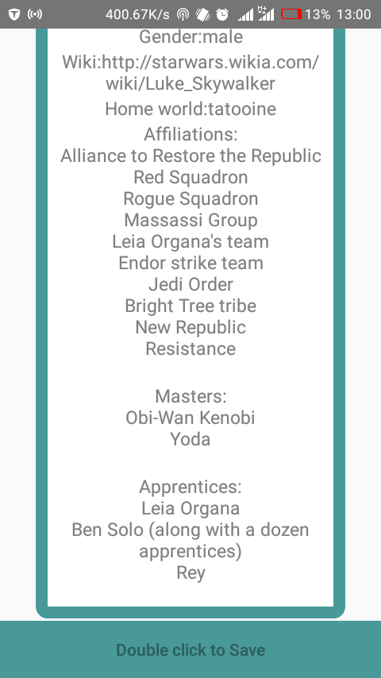
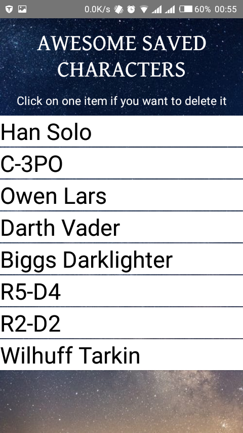

# Star Wars
#### Star Wars, January 11st 2020
#### By **Esther Carrelle**

## Author's name

Esther Carrelle

## Description

This is an android application that fetch from API characters from the movie "STAR WARS" and displays a list of characters.
You can also view details of each character,and u can save locally your favorite characters.
This app allows you to search for a character and allows you to experiment better connection between you and your favorite movie star wars.

## User Requirements

The application allow users to do the following:
1.View list of characters from API
2.View list of saved characters
3.search for a particular character name
4.view details of each character
3.delete a character saved locally

## Technologies Used

* Android(Java)
* Star wars API

## Contact Details

You can contact me through esthcarelle@gmail.com

## License

- This project is licensed under the MIT Open Source license Copyright (c) 2019. [Esther Carrelle](https://github.com/esthcarelle)
